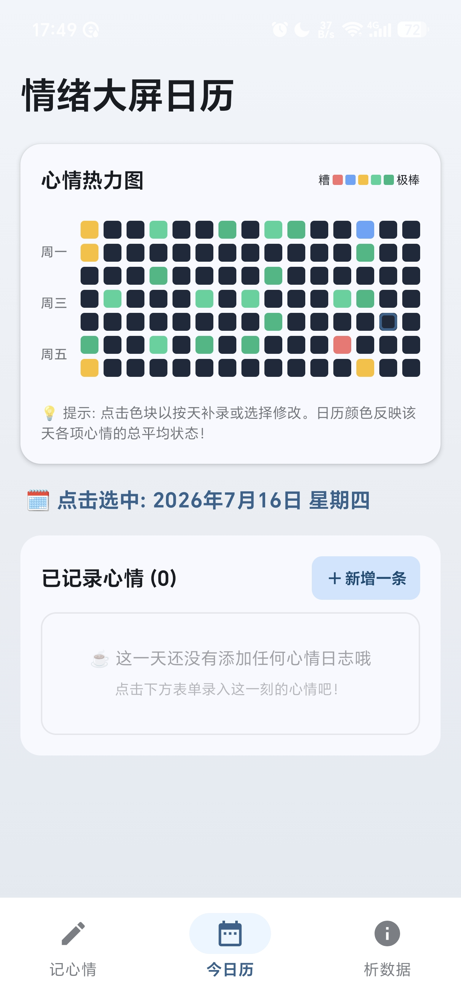
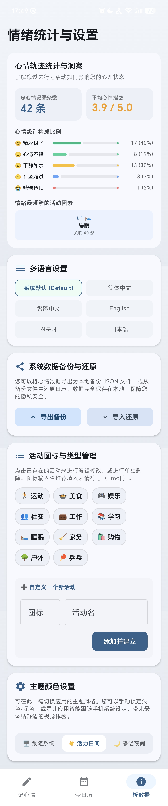
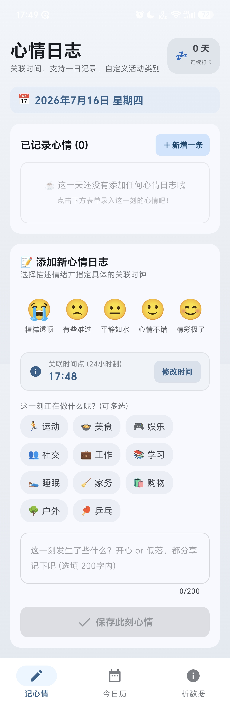

# 📅 心情日志 (Mood Tracker)

<p align="center">
  
</p>

<p align="center">
  <strong>遇见情绪，静享生活的每一个故事。</strong>
</p>

<p align="center">
  <a href="#-核心功能">核心功能</a> •
  <a href="#-界面预览">界面预览</a> •
  <a href="#-技术栈">技术栈</a> •
  <a href="#-自动构建与签名-cicd">自动构建与签名 CI/CD</a> •
  <a href="#-本地运行与构建">运行与构建</a>
</p>

---

## 📖 应用简介

**心情日志** 是一款专为关注心理健康与情绪管理设计的 Android 应用程序。我们采用现代、优雅的 **Jetpack Compose** 与 **Material Design 3** 风格，不仅支持极简的心情日记录入，更提供深度的数据可视化，帮助您洞察自己的情感走势、找出情绪波动的背后“推手”。

应用提供完美的多语言本地化支持，包含**简体中文、繁體中文、English、한국어、日本語**，并支持跟随系统语言。

---

## 🎨 界面预览

### 启动画面 (Splash Screen)
应用配备精美的全屏插画，在静谧的氛围中引导用户开启一天的记录旅程：

<p align="center">
  
</p>

### 功能截图 (Screenshots)
以下为应用实际运行的经典界面（包含心情热力图、心情日记列表、精美的主题/语言设置面板等）：

<p align="center">
  
  
  
</p>

---

## ✨ 核心功能

*   🟩 **心情热力图 (Mood Heatmap)**: 
    *   以高度直观的格栅色块，展示近半年的情绪分布。
    *   色块颜色深浅代表该天所有心情的综合平均值。支持直接点击色块进行**补录**或**修改/查看历史日志**。
*   📊 **全方位情绪洞察 (Statistics & Insights)**:
    *   **心情优良率**: 掌握近期积极情绪的比例。
    *   **平均心情指数**: 洞察情绪波动的基准线。
    *   **心情级别构成比例**: 饼图式直观展示“糟糕、难过、平淡、开心、极棒”的比重。
    *   **情绪频繁活动因素**: 智能分析并列出对特定情绪影响最大的日常活动（如：工作、运动、睡眠等）。
*   🌐 **多语言与本地化 (I18n)**:
    *   支持**自动 (系统默认)**、**简体中文**、**繁體中文**、**English**、**한국어** 和 **日本語** 自由切换。所有界面用词与提示（包括错误弹窗、按键）均完美匹配。
*   🎨 **全新 Material 3 主题**:
    *   内置精致的**风格/主题设置**，界面色彩灵动温和、极具呼吸感。
    *   支持完整的 Edge-to-Edge 沉浸式无边框设计与无缝的 Window Insets 适配。
*   💾 **数据安全与可移植性 (Backup)**:
    *   一键**导出**当前心情历史为安全便携的数据文件。
    *   一键**导入**备份，轻松实现跨设备的数据同步或迁移。

---

## 🛠 技术栈

*   **开发语言**: Kotlin
*   **UI 框架**: Jetpack Compose (Material Design 3)
*   **架构模式**: Clean MVVM + Flow + Coroutines 异步流
*   **本地存储**: Room Database (基于 KSP 驱动的高性能 SQLite 解决方案)
*   **依赖管理**: Version Catalog (`gradle/libs.versions.toml` 集中管理)
*   **构建工具**: Gradle Kotlin DSL (`.gradle.kts`) + KSP

---

## 🚀 自动构建与签名 (CI/CD)

项目已集成完善的 GitHub Actions 工作流。当您为仓库打上 Git Tag 时，GitHub 会自动触发构建，并将签名完成、可直接安装的 Release APK 自动推送到 **GitHub Releases** 页面。

### 工作流配置
工作流脚本位于 `.github/workflows/android.yml`，在执行打包时，会自动从项目的 Actions Secrets 中提取签名参数进行 APK 签名。

### 🔑 所需的 Actions Secrets 环境变量
为使 CI/CD 自动签名与发布能够顺利执行，请在您 GitHub 项目的 **Settings -> Secrets and variables -> Actions** 下配置以下密匙：

| 密匙名称 | 描述 | 示例值 |
| :--- | :--- | :--- |
| `SIGNING_KEY` | 您的 Android 密钥库文件的 **Base64 编码字符串** | *MIIJQgIBAzCCCD8GCSqGSIb3D...* |
| `ALIAS` | 签名密钥的别名 (Alias) | *my-release-key* |
| `KEY_STORE_PASSWORD` | 密钥库 (Keystore) 的密码 | *YourStorePassword* |
| `KEY_PASSWORD` | 签名密钥 (Key) 的专属密码 | *YourKeyPassword* |

---

## 💻 本地运行与构建

### 1. 克隆项目
```bash
git clone <repository_url>
cd mood-log
```

### 2. 编译项目
在项目根目录下使用 Gradle 编译 Unsigned 调试包或执行单元测试：
```bash
# 运行单元测试
gradle :app:testDebugUnitTest

# 编译 Debug APK 并在本地测试
gradle :app:assembleDebug
```

---

*“倾听内心的声音，记录时间的色彩。感谢您使用心情日志！”*
